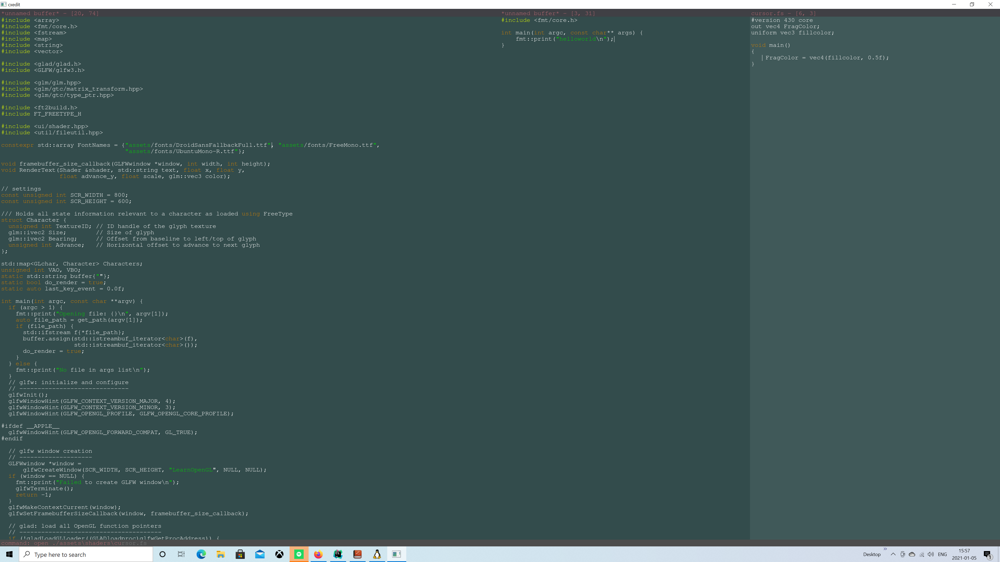

# cxgledit

So I've written small fun text editors, running in a Linux terminal, which is fun and cool, but I wanted to 
write one for Windows, that looks and feels like a terminal editor such as vim or whatever, but renders
using OpenGL.

At least I got it up and running to this, after much swearing. I have 0 knowledge about OpenGL so that's really where
the interesting challenge lies. Watching tutorials online show *no* decent text rendering, and the ones that do
either creates a bunch of textures for each character, or they create a texture atlas (which I ended up doing with some 
help) yet and still issue *one drawcall per character* - which kind of defeats the purpose of having the texture
atlast to begin with. So some hacking lead me to writing the SimpleFont class that can scan text (right now it's just std::string,
I will write my own buffer type, probably a gap buffer or something easy like that to begin with) and create
all the vertex data for a line, or even the entire file, upload that to the gpu and issue 1 draw call - instead of 15000
for a file with 500 lines and 30 character per line average.

Syntax highlighting has improved slightly

### Features on display:
- Split editor windows
- Command input & auto completion (the grayed out part is what it can auto-complete to). If the user hits tab, 
it fills out, if the user hits key up/down it will cycle through the alternatives. This command bar, should probably be in a separate
  panel instead, so that the entire list could be shown and cycled through
  

Syntax highlighting is just hacked to gether for now, and it obviously isn't working with string literals. 
Shouldn't be that hard to fix though, so I've put that on hold for now, dealing with the more interesting stuff.

## Dependencies
Project has a few dependencies on 3rd party libraries. Most of which I've made it so CMake automatically handles
the download of, but some needs manual download and/or installation (locally to the project folder, everything built 
from source)

### Handled by cmake
- [x] GLM, linear algebra/maths library
- [x] GLFW - Window library, handles some of the nasty GL / Window creation and input stuff for us
- [x] fmtlib - because WHO the F* uses iostream for any output to console in C++ anymore, when fmtlib is even faster than printf?!

### Manual installation
- GLAD, OpenGL loader that setups symbols and addresses for function calls into the OpenGL API, if i'm not mistaken.
  [download at](https://glad.dav1d.de/), profile must be set to "Core" and "gl" major:minor version must be set to version 4.3
  However, this has already been done in this repo. So no manual stuff has to be done, it will be git' down when cloned.
- Freetype - The library that reads in a TrueType file and creates data necessary for us to create textures that we can 
  apply to quads, displaying the text. This needs to be manually [download at](https://download.savannah.gnu.org/releases/freetype/ "Get the latest version")
  and placed in the "deps" directory, so for it to work, I've extracted the archive